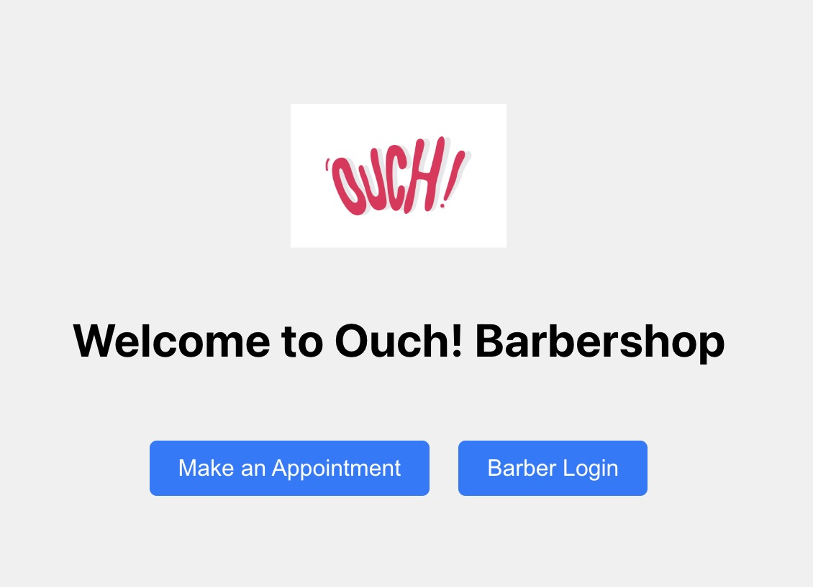
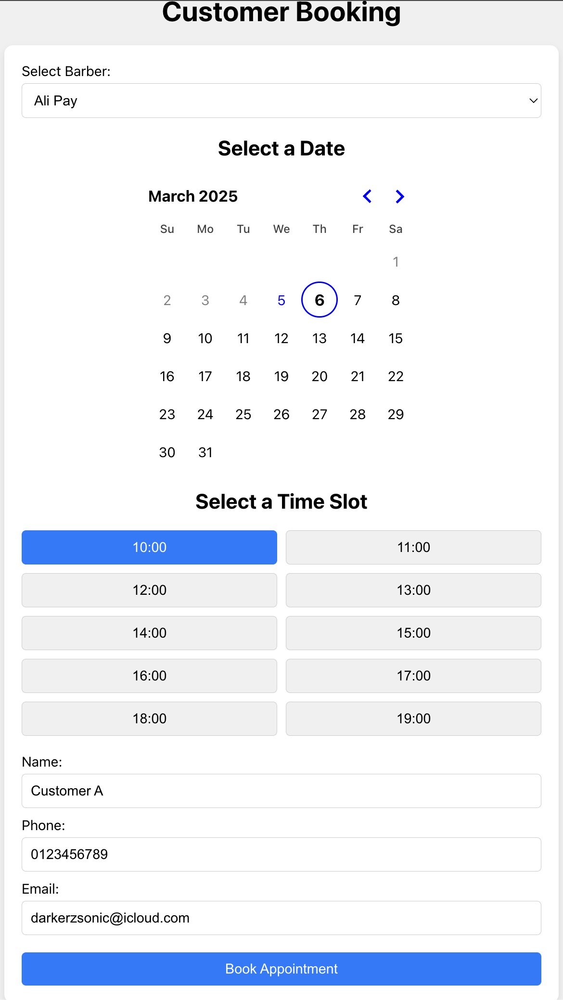
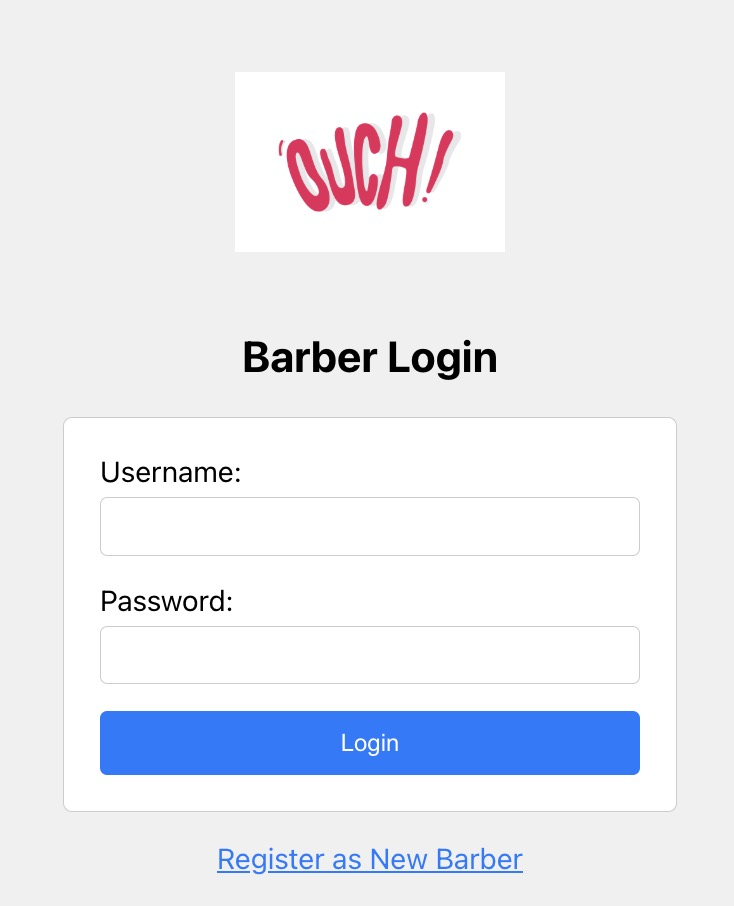
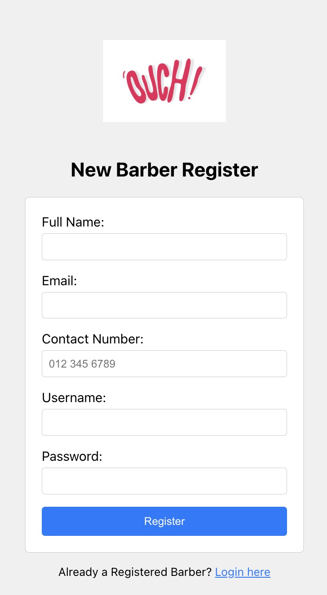
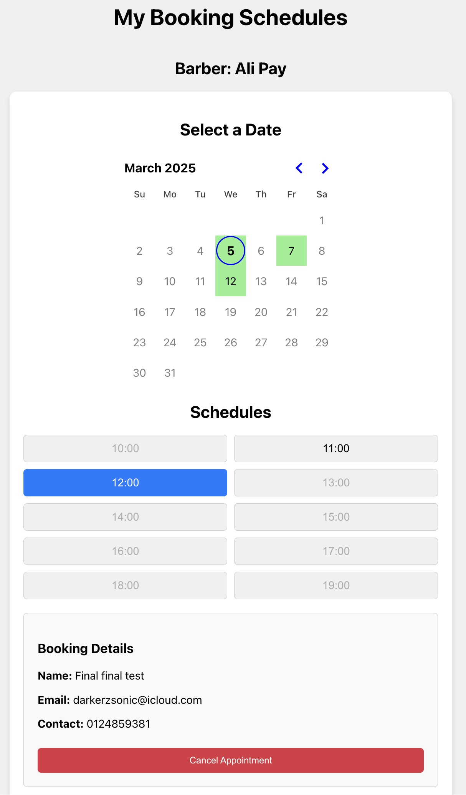
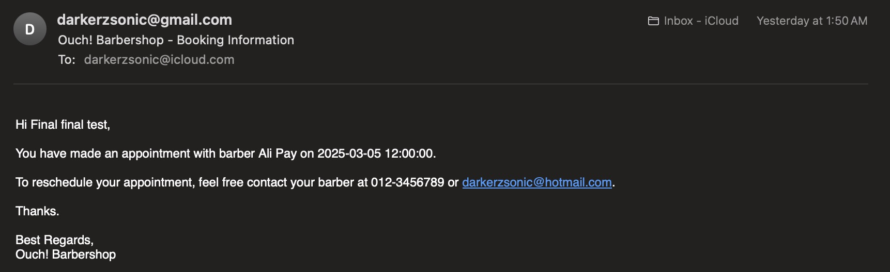
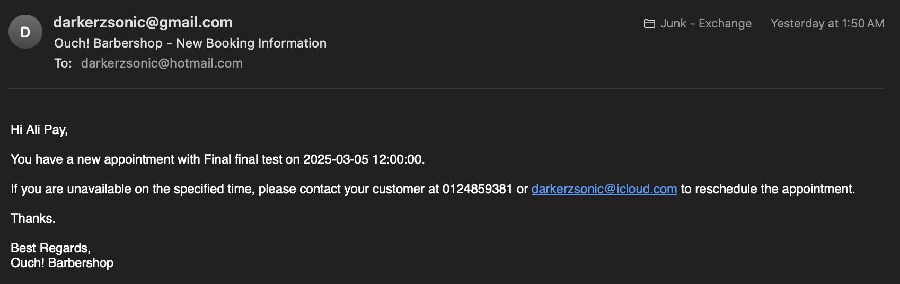
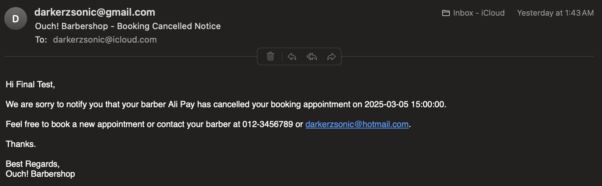
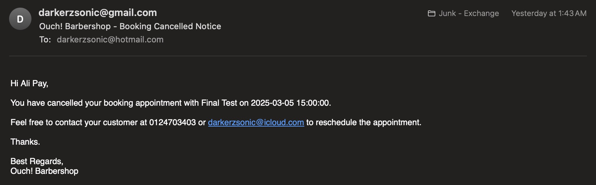

# Barbershop Appointment System

Full stack development for Barbershop Appointment Website on Docker, based on Django + React.js + PostgreSQL. Part of Ouch! technical assessment.

## Frameworks

Pre-requisites: Docker

Front-end: React.js

Back-end: Django (Python)

Database: PostgreSQL

## Project Setup
<!-- ### Frontend Setup -->

#### Clone the repository

```
git clone https://github.com/DarkerzSonic/barbershop_booking_system.git
cd barbershop_booking_system
```

#### Build the Docker images

```
docker-compose build
```

#### Run the Docker containers

```
docker-compose up
```

#### Access the website in the browser

```
http://localhost:3000/
```

## Features
### Home Page


Owners can select the rental month & year, and then enter the contact number of the tenant. User can click on the logo on every webpages to navigate back to the home page.

### Customer Book Appointment Page


Customer can select the desired barber and pick the date and time slot to make an appointment. After filling up the particulars, the customer & barber would receive an email notifications on the made appointment.

### Barber Login Page


Registered barbers can log in to the system with their credentials, or register as a new barber in the system.

### Barber Registration Page


### Barber Booking Page


Registered barbers can view the appointments made by the customers and view their details. The barber can cancel the appointment and an email notifications would be sent to the barber & customer email on the cancellation.

### Email samples
#### Customer Booking Confirmed Email


#### Barber Booking Confirmed Email


#### Customer Booking Cancellation Email


#### Barber Booking Cancellation Email



## Author

**Yeow Ni Jia**

* [github/DarkerzSonic](https://github.com/DarkerzSonic)
* [LinkedIn/ni-jia-yeow](https://www.linkedin.com/in/ni-jia-yeow/)

## License

Copyright © 2025, [Yeow Ni Jia](https://github.com/DarkerzSonic).
<!-- Released under the [MIT License](LICENSE). -->